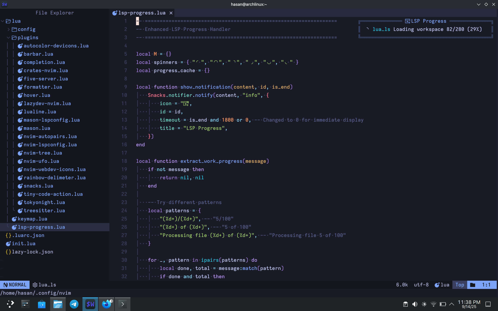

# Neovim Config
My Personal neovim config with great customization.

## Screenshots

## Steps to install

Copy <code>lua</code>, <code>.luarc.json</code> and <code>init.lua</code> to <code>"$HOME/.config/nvim"</code>
